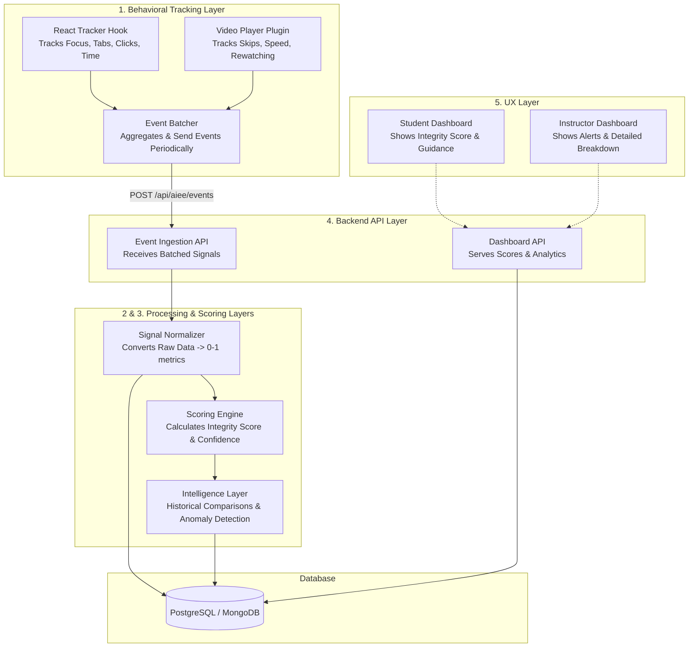

# Assessment Integrity & Engagement Engine (AIEE)

This document outlines the architecture, design, and implementation details for the Assessment Integrity & Engagement Engine (AIEE) within the LMS.

## 1. System Architecture Diagram



## 2. Database Schema (Prisma)

```prisma
model AssessmentAttempt {
  id              String   @id @default(uuid())
  studentId       String
  assessmentId    String
  startTime       DateTime @default(now())
  endTime         DateTime?
  
  // Scoring
  integrityScore  Float?
  confidenceLevel String?  // "HIGH", "MODERATE", "LOW"
  
  // Sub-scores
  quizBehaviorScore     Float?
  answerPatternScore    Float?
  learningEngagementScore Float?
  
  // Signals and Explanations
  flags           String[] // Array of strings e.g., "Multiple tab switches"
  events          AssessmentEvent[]
  
  createdAt       DateTime @default(now())
  updatedAt       DateTime @updatedAt
}

model AssessmentEvent {
  id              String   @id @default(uuid())
  attemptId       String
  attempt         AssessmentAttempt @relation(fields: [attemptId], references: [id], onDelete: Cascade)
  
  eventType       String   // "TAB_SWITCH", "FOCUS_LOST", "ANSWER_SUBMIT", "VIDEO_SKIP"
  timestamp       DateTime @default(now())
  metadata        Json?    // e.g., { duration: 5000, from: 10, to: 50 }
}
```

## 3. Frontend Event Tracking Code (React)

*(See `hooks/use-aiee-tracker.ts` in your project for the full code)*

## 4. Backend API Design

**Endpoint 1: `POST /api/aiee/ingest`**
*   **Purpose:** Receives batched events from the frontend tracker.
*   **Payload:** `{ attemptId: string, events: Array<{ type: string, timestamp: number, metadata?: any }> }`
*   **Logic:** Validates payload, appends events to the database under the given `attemptId`. Returns `202 Accepted`.

**Endpoint 2: `POST /api/aiee/evaluate`**
*   **Purpose:** Triggers the scoring engine when an assessment is submitted.
*   **Payload:** `{ attemptId: string }`
*   **Logic:** Fetches all events and answers for the attempt. Runs the scoring engine, saves the `integrityScore` and `confidenceLevel`, and returns the results.

**Endpoint 3: `GET /api/aiee/dashboard/instructor/:assessmentId`**
*   **Purpose:** Provides analytics for the instructor dashboard.
*   **Response:** List of attempts, sorted by `integrityScore` (ascending). Includes detailed breakdown and flags for low-confidence attempts.

## 5. Scoring Engine Implementation (Node.js)

*(See `lib/aiee/scoring-engine.ts` in your project for the full code)*

## 6. Sample Output JSON

```json
{
  "attemptId": "usr_attempt_987654",
  "studentId": "std_12345",
  "integrityScore": 68,
  "confidenceLevel": "MODERATE",
  "subscores": {
    "quizBehavior": 0.45,
    "answerPattern": 0.8,
    "learningEngagement": 0.9
  },
  "flags": [
    "Detected 4 tab switches.",
    "Focus lost 6 times during the assessment."
  ],
  "studentMessage": "Your assessment confidence score is Moderate. To improve this score in the future, please avoid switching tabs or minimizing the window during the quiz."
}
```

## 7. Instructor Dashboard Structure

The UI will feature a clean, data-heavy table design using standard LMS components (e.g., Shadcn UI).

**Top Metrics Cards:**
*   Total Submissions
*   Average Integrity Score
*   Attempts Flagged for Review (Low Confidence)

**Student Roster Table:**
*   **Columns:** Student Name, Score, Time Spent, Integrity Score (Color Coded: Green/Yellow/Red), Status.
*   **Expansion Row:** Clicking a row expands to show:
    *   **Behavior Timeline:** A horizontal timeline plotting `TAB_SWITCH`, `FOCUS_LOST`, and `ANSWER_SUBMIT` events.
    *   **Subscores Radar Chart:** Visual representation of Quiz Behavior vs Answer Pattern vs Engagement.
    *   **AI Summary:** "Student spent normal time on questions but switched tabs 4 times immediately before answering questions 3 and 7."

## 8. Suggestions for Scaling this System

1.  **Event Batching & Debouncing:** The React tracker currently batches events every 10 seconds. In high-traffic scenarios, adjust the interval or batch size dynamically based on network load.
2.  **Message Queue / Stream Processing:** Instead of direct database inserts for every event via the API, push events into a message queue (Kafka, RabbitMQ, or AWS SQS) or Redis Streams. A background worker can then consume and persist them to the DB without blocking API requests.
3.  **Timeseries Database:** If the event volume grows significantly, relational databases (PostgreSQL) might struggle with billions of event rows. Consider moving `AssessmentEvent` data to a time-series DB like InfluxDB or ClickHouse.
4.  **Async Evaluation:** Do not run the `ScoringEngine` synchronously during the student's submission request. Place the evaluation task in a background queue (e.g., BullMQ) to ensure the UI remains snappy.
5.  **Extensible Intelligence Layer:** By structuring the data cleanly now, you can later train a lightweight Random Forest or XGBoost model on the historical data to detect anomalies, replacing the static threshold formulas with machine learning inference.
